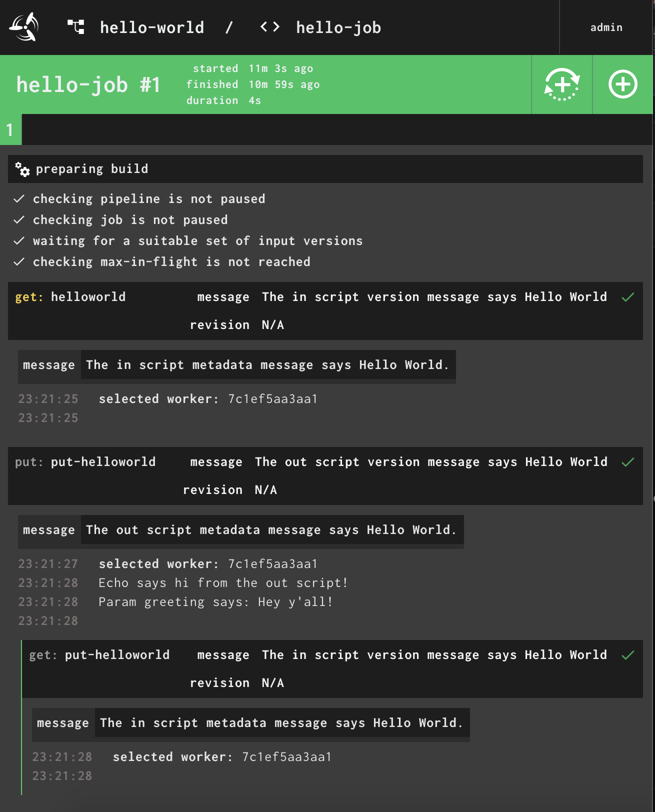

#Creating a Hello World Resource Type for Concourse#


## What is Concourse?

> Concourse is an open-source continuous thing-doer.

Concourse is a CI/CD tool that is configurable with a simple YAML file.


## The Walkthrough


### Pre-Requisities

Follow the steps on https://concourse-ci.org/ to install Fly & Concourse.
If this is your first time checking out Concourse, I would highly recommend reviewing the tutorials & docs they have posted.

### Exploring a basic Resource Type

You can follow along using or (fork my repo)[https://github.com/thehandsomezebra/concourse-resourcetype-helloworld].

A concourse `resource_type` works well using a minimum of 4 files:

```
+-- resource
|   +-- check
|   +-- in
|   +-- out
+-- Dockerfile
```

Each of the scripts are required to have the output of its execution in json appropriate format.

Let's walk thru each file at a high level and get everything set up!

---


### check
The check file is going to check for new versions.

The check script we will report back a message of Hello World.
```
#!/bin/bash
set -eu
set -o pipefail
echo '[{ "revision": "N/A",  "message": "The check script says Hello World!" }]'
```

---


### in

This fetches the given resource.

For the In script, let's add some metadata.  This metadata will be viewable in a few places in the pipeline.
```
#!/bin/bash
set -eu
set -o pipefail
echo '{ "version": { "revision": "N/A", "message": "The in script version message says Hello World" }, "metadata": [{ "name": "message", "value": "The in script metadata message says Hello World." }] }'

```

---


### out

For the Out script, let's get a little more complex.  We'll be getting a variable `greeting` from the pipeline, and let's echo it out.
We'll be using jq to grab it from the params that get passed via the pipeline.


```
#!/bin/bash
echo '{ "version": { "revision": "N/A", "message": "The out script version message says Hello World" }, "metadata": [{ "name": "message", "value": "The out script metadata message says Hello World." }] }'

set -e -u

exec 3>&1 # make stdout available as fd 3 for the result
exec 1>&2 # redirect all output to stderr for logging

echo "Echo says hi from the out script!" >&2

source=$1

if [[ -z "$source" ]]; then
  echo "usage: $0 <path/to/source>"
  exit 1
fi

# for jq
PATH=/usr/local/bin:$PATH

export TMPDIR=${TMPDIR:-/tmp/rclone}
mkdir -p "${TMPDIR}"

payload=$(mktemp "$TMPDIR/resource-request.XXXXXX")
cat > "$payload" <&0

greeting=$(jq -r '.params.greeting // ""' < "$payload")
echo "Param greeting says: $greeting" >&2
```

---


### Dockerfile

This Dockerfile will be short and sweet. 

- Spins up a tiny Alpine Linux instance
- Loads in bash & jq
- Adds in our script files to the /opt/resource folder
- Makes those files executable 
- Specifies that we will be running bash in root

```
FROM alpine:3.13

RUN apk add --update --upgrade --no-cache bash

RUN apk update \
    && apk upgrade \
    && apk add --update bash curl unzip jq

ADD resource/ /opt/resource/
RUN chmod +x /opt/resource/*

WORKDIR /
ENTRYPOINT ["/bin/bash"]
```


---


### One last file to get it running: the pipeline yaml file

This file does not need to be in the docker - but it's inluded in my repo, so you can follow along.

**Create a file called hello-pipeline.yml**

```
resource_types:
- name: helloworld
  type: docker-image
  source:
    # set repo of your helloworld resource
    #repository: Your-Docker-Acct/Your-Docker-Repository
    ## or use my helloworld resource
    repository: thehandsomezebra/concourse-test

resources:
- name: helloworld
  type: helloworld

jobs:
- name: hello-job
  plan:
  - get: helloworld
  - put: put-helloworld
    resource: helloworld
    inputs:
         - helloworld
    params:
      greeting: "Hey y'all!"
```

This is going to create a new pipeline called hello-job that will `get` the `in` and `put` the `out`.


# Get it running
Following the steps above, create a github repo ([or fork mine](https://github.com/thehandsomezebra/concourse-resourcetype-helloworld)) & create a docker hub repo. It's fast to connect your github repo to docker and even set it up to autobuild ([learn more about that here](https://docs.docker.com/docker-hub/builds/))).

Once your repo is ready in Docker Hub, let's start the concourse pipeline by using this line


Let's start the hello-world pipeline!
Run the following in your terminal.

```
fly -t ci set-pipeline -c hello-pipeline.yml -p hello-world
```
_`ci` will be the name of your target (if you followed a the tutorial, it might be named `tutorial` or `example`)_

If we look at the pipeline diagram, we can also see the result of the `check` step in the box with the dashed lines (dependency - trigger).


Checking our job, we can see our messages in each of the stages.




There's a lot you can do creating your own resource types for concourse - be sure to [check out the Resource Types catalog](https://resource-types.concourse-ci.org/), [contribute to the community](https://github.com/concourse/resource-types/blob/master/README.md) and get assistance (or lurk thru questions that have been already answered) in [Discord in the #resource-types channel](https://discord.gg/MeRxXKW).


_Note: I'm not affiliated with Concourse - I am just a nerd that is fascinated by the continuous thing-doer continuously doing things._

---
#### Sources:

- https://concourse-ci.org/implementing-resource-types.html
- https://github.com/concourse/resource-types/blob/master/README.md
- https://github.com/concourse/concourse/wiki/Tutorials
