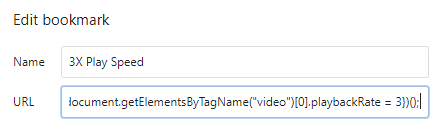

Do you enjoy consuming your media at 3x or 4x speed and you're bummed that you can only speed up your YouTube videos up to 2x?
Many people choose learning in an online, self-paced environment.  I find myself frequently diving into training at 2.5x or 3x speed -- and I've found it dissapointing that YouTube tops out at only 2x speeds.  

This Chrome Bookmarklet will help you speed up your YouTube video beyond the 2x speed limit!

## Gotta Go Fast

This is a Bookmarklet for Chrome and may not be suitable in other browsers.  Your mileage may vary.

1. Right click on the bookmark bar.
1. Click "Add page..."
1. Name: "Play 3X Speed"
1. In the URL bar, paste this:
```
javascript:(function(){document.getElementsByTagName("video")[0].playbackRate = 3})();
```
1. Click Save.

1. Next time you watch a youtube video, click this bookmark and it'll speed up to 3X.


If you'd like a different variable, you can change the `playbackRate = ` number to something other than 3.  You can try .25 or .5 increments, too!


### Alternatives

If you like this idea, but you'd like a little more flexibility, you can use this code to ask for a prompt:


```
javascript:(function(){document.getElementsByTagName("video")[0].playbackRate = prompt("Please enter the speed you wish to watch the video", "1")})();
```


#### Other Notes

The YouTube video GUI will not update with the new speed, but as soon as you adjust it to a different value, it will return to normal functionality.

